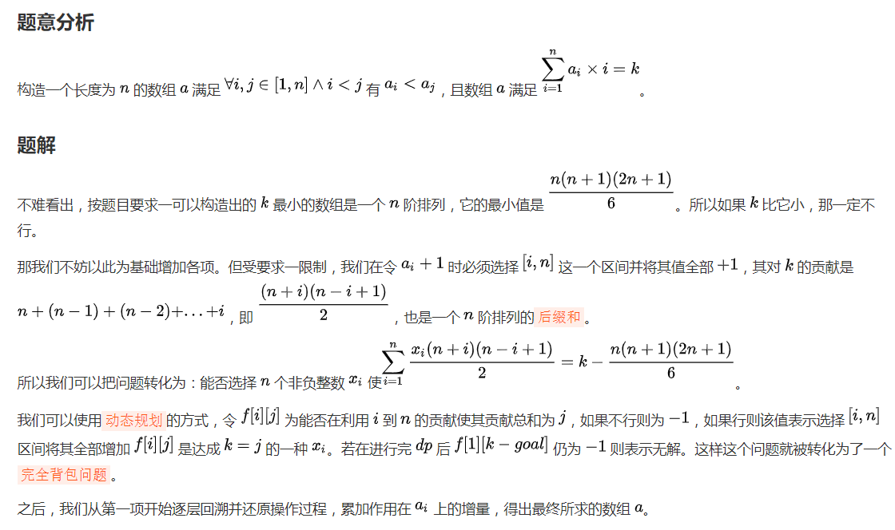

#### [备用返回通道](../../README.md)
# [转到题目](https://ac.nowcoder.com/acm/contest/101921/E)


```cpp
void solve(){
    int n, k, alt = 0;
    cin >> n >> k;

    int g = k - (n * (n + 1) * (2 * n + 1) / 6); // 直接对上式求和再求前n项和公式就是这个，不会爆LL，放心
    if(g < 0){ // 比基础排列还小的话，那一定不满足题目要求
        cout << -1 << endl;
        return;
    }

    vector<int> chs(n), R(n, 0), cnts(n, 0);
    vector<vector<int>> f(n + 1, vector<int>(g + 1, -1));
    for(int i = 0; i < n; ++i) chs[i] = (n + i + 1) * (n - i) / 2; // 因为我习惯是0-index所以和上文所述的公式有所差异，换成1-index是一样的。

    f[n][0] = 0;
    for(int j = 1; j <= g; ++j) f[n][j] = -1;
    for(int i = n - 1; i >= 0; --i){
        for(int j = 0; j <= g; ++j) if(f[i + 1][j] != -1) f[i][j] = 0; // 如果从下一个数字开始选的方案可行，那至少存在一个 x[i] = 0，使x序列满足最终要求。 
        for(int j = chs[i]; j <= g; ++j) if(f[i][j - chs[i]] != -1) f[i][j] = f[i][j - chs[i]] + 1; // 进行一个背包 
    }

    if(f[0][g] == -1){
        cout << -1 << endl;
        return;
    }
    
    int now = g; // 从初始值，即k个基础排列权值的差值开始
    for(int i = 0; i < n; ++i){
        while(now >= chs[i] && f[i][now] > 0){ // 回溯操作过程
            ++cnts[i]; // 记录选了一个
            now -= chs[i]; // 撤销当前贡献
        }
        alt += cnts[i];
        R[i] = (i + 1) + alt;
    }

    for(int i = 0; i < n; ++i) cout << R[i] << " ";
    cout << endl;
    return;
}

```