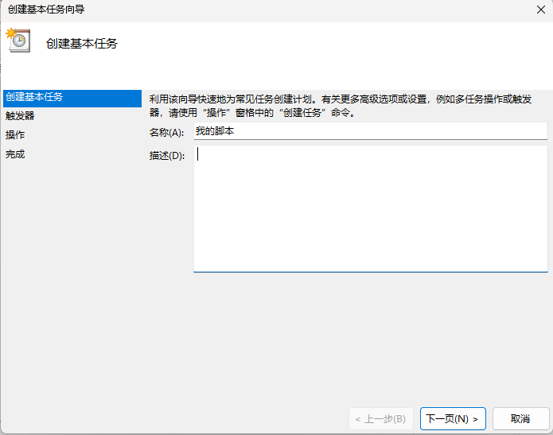
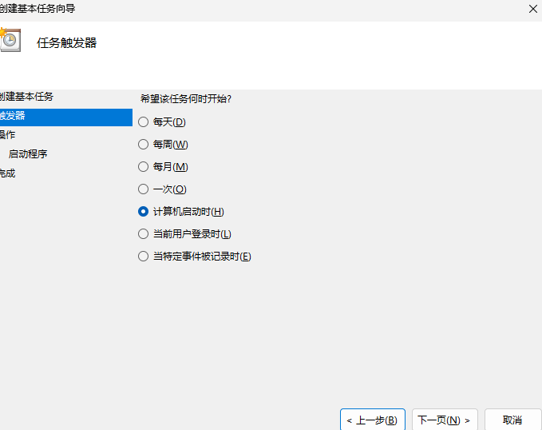
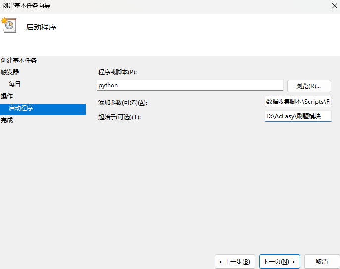
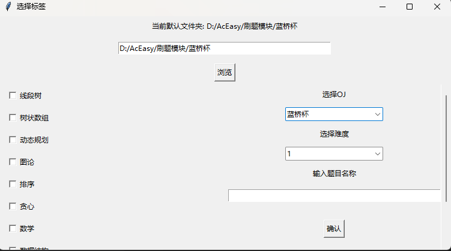

# 如何上传自己的补题?
**如果你是第一次上传,这里需要将几个脚本设置为开机自启动**

###  Python环境
*关于如何配置环境?*
[转到文档](../数据收集脚本/README.md)
### 配置脚本自启动
1. 打开系统中的
2. 创建基本任务
    几个关键设置
    #### 名称:刷题模块数据收集脚本
    - 触发器:计算机启动时
    - 操作:启动程序:python
      - 参数: `"数据收集脚本\Scripts\DataVisualization\src\main.py --mode 0 --interval 5"`
      - 起始于: <`刷题模块目录的绝对路径`>
    #### 名称:文件创建助手
    - 触发器:计算机启动时
    - 操作:启动程序:python
      - 参数: `"数据收集脚本\Scripts\FileCreateer\src\main.py"`
      - 起始于: <`刷题模块目录的绝对路径`>

**例:** 

# **这里我举出我电脑上,配置第二个脚本**


- 触发器:计算机启动时
- 操作:启动程序:python 
  - 参数: 数据收集脚本\Scripts\FileCreateer\src\main.py
  - 起始于: D:\AcEasy\刷题模块

# 配置私有化配置
**在data文件夹内创建 currentUser.json文件**
```json
{
    "username": "user123",                         //你的博客作者名
    "default_folder": "D:/AcEasy/刷题模块/蓝桥杯"   //你每次创建新文件时的默认文件夹目录
}
```
### 创建用`ctrl+shift+c`唤起文件创建助手窗口