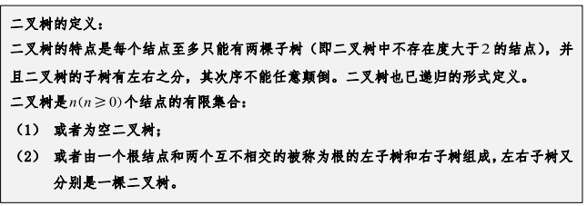
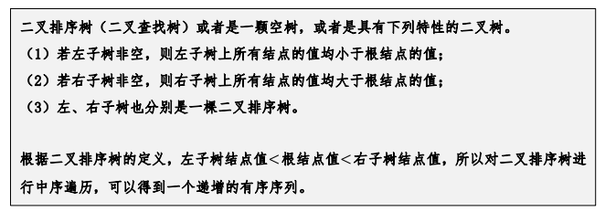
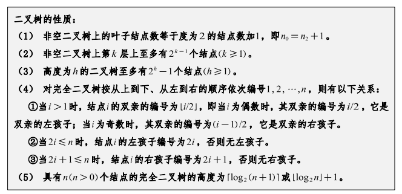
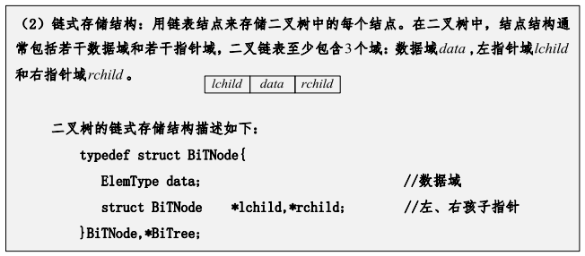
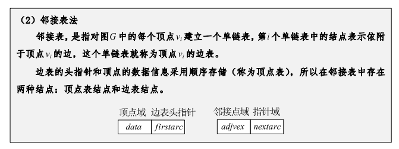
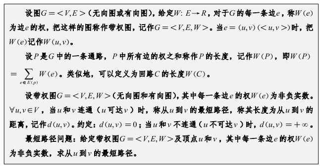
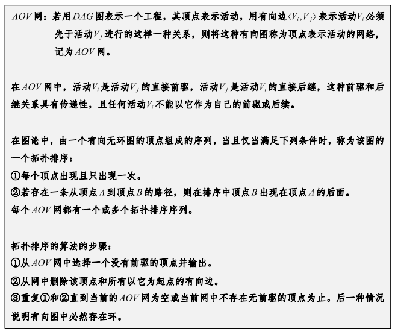

> # [退回](../README.md)
> # 非线性结构
> 
> ## 矩阵
> ### 矩阵的压缩存储
> 
> - 对称矩阵
> 
> - 三角矩阵
> 
> - 稀疏矩阵
> 
> 
> ---

> ## 树
> 
> 
> ### 树的概念
> 
> 
> 
> ### 树的术语
> 
> 
> 
> ### 树的性质
> 
> 
> 
> ### 树的遍历方式
> - 先根遍历`(DFS)`
> - 后根遍历`(DFS)`

> ### 二叉树
> 
> #### 二叉树的定义
> 
> 
> 
> #### 特殊二叉树
> 
> - 完全二叉树
> - 满二叉树
> - 平衡二叉树
> 
> #### 二叉树应用
> 
> - __二叉搜索树/二叉排序树__（BST）
>   
> - __哈夫曼树__(最优二叉树)
>   
> - 堆
> #### 二叉树的性质
> 
> 
> 
> #### 二叉树的存储
> 
> - 
> - 
>   
> #### 二叉树的遍历
> 
> - 前序遍历`(DFS)`
> - 中序遍历`(DFS)`
> - 后序遍历`(DFS)`
> - 层序遍历`(BFS)`
> 
 
> ## 森林
> ### 森林的定义
> - **森林**是指由多个互不相交的树组成的集合。
> ### 将树、森林转换为二叉树
> **左孩子右兄弟|左兄弟右孩子** -> `维持树的层级结构`
> ### 森林的遍历
> - 先序遍历`(DFS)`
> - 中序遍历`(DFS)`
> ---

> ## 图
> ### 图的概念
> 
> 
> ### 图的存储
> - 邻接矩阵
>   
>   - 特点
>     - 无向图的邻接矩阵是对称矩阵
>     - 稀疏图的邻接矩阵很稀疏
>     - 稠密图的邻接矩阵很密集
>     - 对应无向图的度矩阵，每个元素的值为度数
>     - 对应有向图的入度矩阵，每个元素的值为入度
>     - 对应有向图的出度矩阵，每个元素的值为出度
> - 邻接表
>   
>   - 特点
>     - 无向图的存储空间为$O(|V| + 2|E|)$
>     - 有向图的存储空间为$O(|V|+|E|)$
>     - 稀疏图邻接表极大减少了存储空间
>     - 图的邻接表不唯一
> 
> - 十字链表
> - 邻接多重列表
> 
> 
> | 存储方法       | 优势                          | 劣势                          | 适用场景                     |
> |----------------|-------------------------------|-------------------------------|------------------------------|
> | 邻接矩阵       | 快速查询边，适合稠密图        | 空间浪费，适合稠密图            | 稠密图、快速边查询           |
> | 邻接表         | 节省空间，适合稀疏图          | 查询邻接节点较慢                | 稀疏图、简单图操作           |
> | 邻接多重列表   | 存储多属性边，适合复杂图      | 查询效率较低，结构复杂          | 加权图、多属性图             |
> | 十字链表       | 双向查询高效，适合有向图       | 实现复杂，存储占用较高          | 有向图，双向图操作           |
> ### 图的遍历
> - 深度优先搜索`(DFS)`
> - 广度优先搜索`(BFS)`
> 
> ### 图的应用
> 
> #### 最小生成树(特指无向图的)
> ##### 最小生成树的性质
> - 最小生成树是唯一的
> - 最小生成树的权值是树中边的权值的最小值
> - 最小生成树的权值是唯一的
> - 最小生成树的边数等于顶点数减一
> ##### 最小生成树的算法
> - Prim算法
>   `局部贪心,过程局部有解`
>   
> - Kruskal算法
>   `全局贪心,过程全局无解`
>   
> #### 最短路径
> ##### 最短路径的概念
> 
> 
> #### 拓扑排序
> ##### 拓扑排序的概念
> 
> #### 关键路径
> ##### 关键路径的概念
> 
